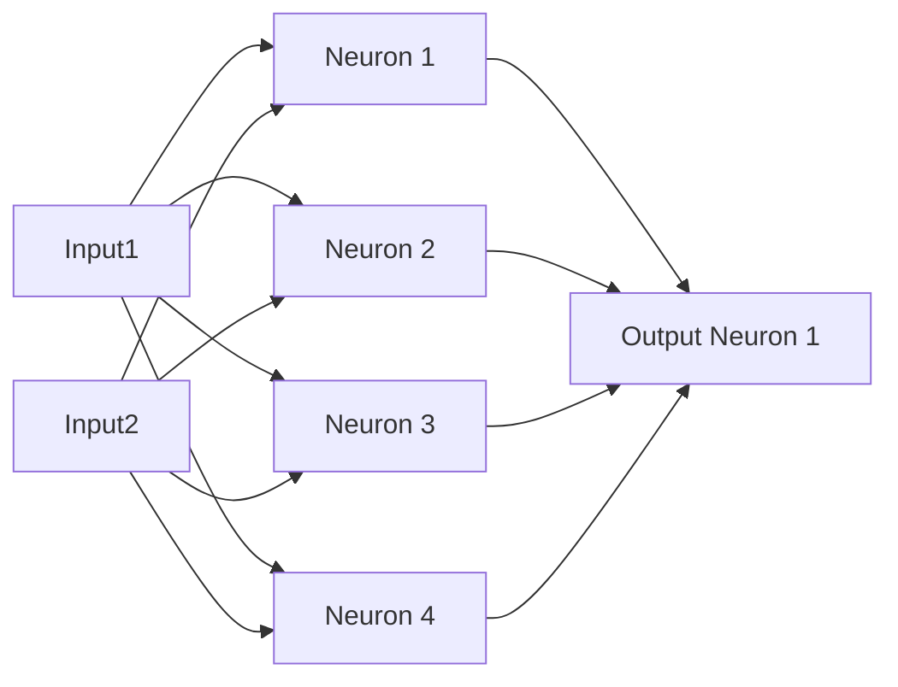

Neural networks with automatic differentiation and backprop in Java from scratch.

Two parts:

- Automatic differentiation which uses chain rule to calculate gradients for a computation graph. 
- Neural network structure which uses the automatic differentiation (autodiff) to learn.

## Test cases:

### Flip a sign

Easy test case with only one neuron.

### XOR problem

The XOR function is a simple problem which cannot be solved just by linear separation. 

Exclusive OR (XOR) has the following truth table:

| Input 1  | Input 2 | Output |
| -------- | ------- | ------ |
| 0  | 0    |   0     |
| 0 | 1     |   1    |
| 1    | 0    |  1     |
| 1    | 1    |  0     |

The following diagram depicts the structure of the neural network which learns the XOR function. The network has 2 input nodes, 2 neurons in the hidden layer and 1 output node.

The MSE error is plotted here.

## TODO:

Try:

- MNIST. Would be interesting to see if it would be possible to learn recognize the MNIST hand written digits.

- Vectorization. Maybe some simple CPU based (AVX) vectorization at first.
