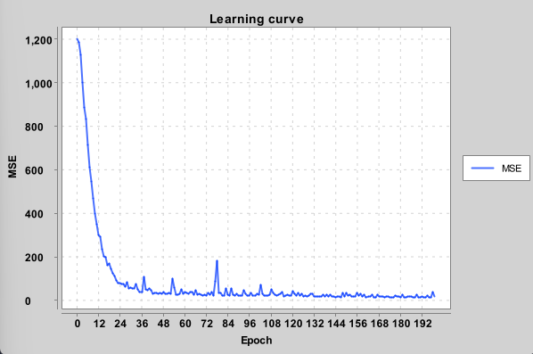

## Neural networks and autodiff in Java

Neural networks with automatic differentiation and backprop in Java from scratch. 

Code has two main parts:

- Automatic differentiation which uses chain rule to calculate gradients for a computation graph. 
- Neural network structure which uses the automatic differentiation (autodiff) to learn. This is done by minimizing the loss function by gradient descent using the calculated gradients.

## Test cases:

In addition to unit tests it's good to have some full functionality test cases of varying difficulty.

### Flip a sign

Easy test case with only one neuron.

### XOR problem

The XOR function is a simple problem which cannot be solved just by linear separation. 

Exclusive OR (XOR) has the following truth table:

| Input 1  | Input 2 | Output |
| -------- | ------- | ------ |
| 0  | 0    |   0     |
| 0 | 1     |   1    |
| 1    | 0    |  1     |
| 1    | 1    |  0     |

The following diagram depicts the structure of the neural network which learns the XOR function. The network has 2 input nodes, 2 neurons in the hidden layer and 1 output node.

The XOR problem is solvable with 2 hidden neurons, here I'm using 4 neurons and a Relu because it seems to learn faster. The network structure is initialized like this:

        Model model = new ModelBuilder()
            .add(new InputLayer(2))
            .add(new DenseLayer(4))
            .add(new Relu())
            .add(new DenseLayer(1))
            .add(new Linear())
            .add(new MSELoss())
            .build();

The error between predicted values and the ground truth values is what we are trying to minimize. Here we are using mean squared error (MSE) function. The MSE error for the training run is plotted here ("the learning curve") for a learning session of 40 epochs.

### Function prediction

Make the network learn a simple function, in this case X^2. This is a simple toy problem for testing.

Predictions vs. truth values: 

Learning curve:

## TODO:

- Pluggable loss functions
- Pluggable weight initialization tactics
- Pluggable activation functions
- Try MNIST. Would be interesting to see if it would be possible to learn recognize the MNIST hand written digits.
- Vectorization. Maybe some simple CPU based (AVX) vectorization at first.

## Dependencies

XChart for plotting https://github.com/knowm/XChart

